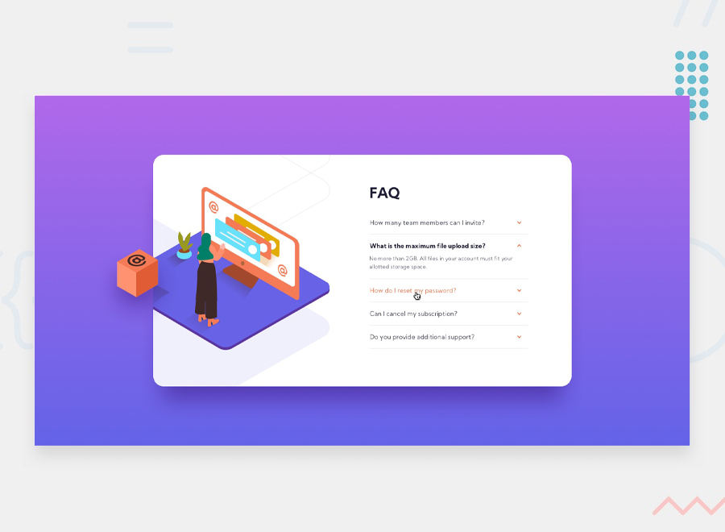

# Frontend Mentor - FAQ accordion card solution

This is a solution to the [FAQ accordion card challenge on Frontend Mentor](https://www.frontendmentor.io/challenges/faq-accordion-card-XlyjD0Oam). Frontend Mentor challenges help you improve your coding skills by building realistic projects.

## Table of contents

- [Overview](#overview)
  - [The challenge](#the-challenge)
  - [Links](#links)
- [My process](#my-process)
  - [Built with](#built-with)
- [Author](#author)

## Overview

### The challenge

Users should be able to:

- View the optimal layout for the component depending on their device's screen size (mobile or desktop)
- See hover states for all interactive elements on the page (collapsible questions)
- Hide/Show the answer to a question when the question is clicked

### Links

- Live Site URL: [github pages](https://gerardocianciulli.github.io/faq-accordion/)

## My process

### Built with

- Semantic HTML5 markup
- CSS custom properties
- Flexbox
- CSS Grid
- jQuery
- Media Queries
- Mobile-first approach

## Author

- Portfolio - [Gerardo Cianciulli](https://www.behance.net/gerardo-cianciulli)
- Frontend Mentor - [Gerardo Cianciulli](https://www.frontendmentor.io/profile/GerardoCianciulli)
- Linkedin - [Gerardo Cianciulli](https://www.linkedin.com/in/gerardo-cianciulli/)
